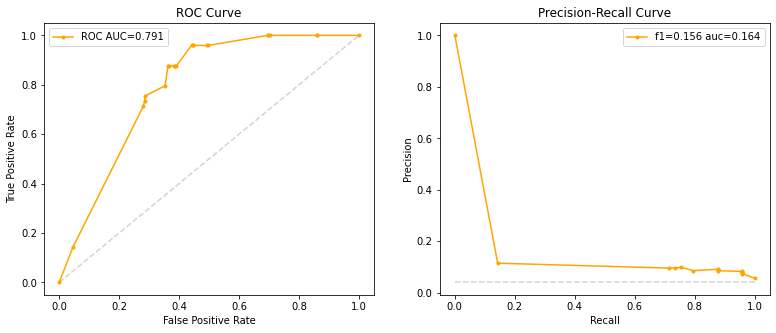

# :hospital: Stroke Prediction
## Using Artifical Neural Networks, Ensamble Models, and Explainable AI

| Team Members in Alphabetical Order | Email | 
|---------|-----------------|
| Eirik Berge | eirik.berge@ntnu.no |
| Camilla Idina Jensen Elvebakken| cielveba@stud.ntnu.no |
| Martin Ludvigsen | martilud@ntnu.no |

To install the needed package dependencies, simply run `pip install -r requirements.txt`

## Table of Contents
1. [TL;DR: Predicting Stroke with Advanced Statistical Methods](https://github.com/ebbeberge/stroke-classification#tldr-predicting-stroke-with-advanced-statistical-methods)
2. [About the Dataset](https://github.com/ebbeberge/stroke-classification#about-the-dataset)
3. [Data Exploration](https://github.com/ebbeberge/stroke-classification/blob/main/README.md#data-exploration)
4. [Models Developed](https://github.com/ebbeberge/stroke-classification/blob/main/README.md#models-developed)
5. [Explainable Artificial Intellegence](https://github.com/ebbeberge/stroke-classification#explainable-artificial-intellegence)
6. [Conclusion](https://github.com/ebbeberge/stroke-classification#conclusion)

## TL;DR: Predicting Stroke with Advanced Statistical Methods

We analyze a stroke dataset and formulate various statistical models for predicting whether a patient has had a stroke based on measurable predictors. The goal is to, with the help of several easily measuable predictors such as ```smoking```,  ```hyptertension```, ```age```, to predict whether a person will suffer from a stroke. Since the data is heavily skewed (about 96% of the patients have never suffered a stroke), then we are forced to consider other measures than simply the accuracy of the model. As such, we develop various methods where we report both the accuracy, the recall, and the precision of the methods. For the full technical report, see

:rocket: <a href=https://github.com/ebbeberge/stroke-classification/blob/main/Index.html> Full Technical Report</a> :rocket:

## About Stroke and the Dataset


A stroke is a condition where the blood flow to the brain is decreased, where the lack of blood flow causes cell death in the brain. One can roughly classify strokes into two main types: ```Ischemic stroke```, which is due to lack of blood flow, and ```hemorrhagic stroke```, due to bleeding. Both of the varients causes the brain to stop functioning properly. As strokes are one of the leading causes of death, it is of vital imporantance to understand the condition, as well as being able to predict the condition in advanced so that preventory measures can be taken to decrease the change. If you suspect that someone is experiencing a stroke (due to e.g. struggling to say simple complete sentences, or struggling to smile), then call your respective immergency number (in Norway: 113) immediately. For more information about the illness (in Norwegian), see

<a href=https://www.helsenorge.no/sykdom/hjerneslag/hjerneslag-arsaker/#ring-113-umiddelbart> Helsenorge - Stroke (Hjerneslag) </a>

The dataset stems from <a href=https://www.kaggle.com/fedesoriano/stroke-prediction-dataset> Kaggle - Stroke Prediction </a> and records several details about over 5000 patients along with whether they have experienced a stroke. The complete list of recorded variables of the patients are:

* **id**: unique identifyer
* **gender**: gender of the patient (*Male*, *Female*, *Other*)
* **age**: age of the patient
* **hypertension**: if the patient has hypertension or not (1,0)
* **heart_disease**: if the patient has a heart disease or not (1, 0)
* **ever_married**: if the patient was ever married (*No*, *Yes*)
* **work_type**: what kind of work the patient has (*Children*, *Govt_job*, *Never_worked*, *Private*, *Self-employed*)
* **residence_type**: what type of place the patient lives in (*Rural*, *Urban*)
* **avg_glucose_level**: average glucose level in blood
* **bmi**: body mass index
* **smoking_status**: smoking status of patient (*formerly smoked*, *never smoked*, *smokes*, *Unknown*)
* **stroke**: if the patient has had a stroke or not (1, 0)

Unfortunately, the origin of the data is confidential, so we do not have any context regarding the data other than the variables listed above. In particular, we do not know the origin of the patients, nor do we know why the patients filled out the information we have been presented with. If the patients already had a sufficient medical history so that a e.g. a physician asked them to fill out the details presented, then this can heavily influence the data we have been given. With such little information about the data collected, the models we develop can only be used for illustrative/educational purposes. For furter development of the project, the focus should be on better data quality rather  than more advanced models.

## Data Exploration

In the data, there are 201 patients where their ```bmi``` has not been reported. Due to this being a possible relevant variable, we have chosen to remove these patents since they only consitute 4% of the total amount of patients. For the variable ```gender```, there are the three options <b>Male</b>, <b>Female</b>, and <b>Other</b>. Since there is only 1 patient whom is registered with the gender <b>Other</b>, we must unfortunately discard this patient as we will not be able to use this information in a statistical significant way. The variable ```smoking_status``` has the options <b>never smoked</b>, <b>formerly smoked</b>, <b> smokes</b>, and <b>unknown</b>. Since there are a significant amount of patents registered with <b>unknown </b> as their smoking status, we have choosen to include these patents in the study.

The following histogram shows the age distribution of the patents that have experienced a stroke:

<p align="center">
  
</p>

We see that more old people than young people have strokes, while we seem to have a good representation of all ages in the dataset. Hence it seems that ```age``` will be an important predictor for predicting ```stroke```. We end this section by showing a heatmap of the correlation between the different variables:

<p align="center">
  
</p>

We see from the heatmap above that the response ```stroke``` does not seems particularily correlated with any of the predictors. Thus the choice of non-linear models such as ensembles and neural networks is well motivated. When using methods with the assumtion that the features are independent we have to be careful though - many of the features are highly correlated with each other, for example ```age```, ```ever_married``` and ```children```.

## Models Developed

We develop several models to predict the binary variable `stroke` based on the other variables. The models we develop are:

- _Logistic Regression (with Ridge Penalty)_
- _A Simple Deep Neural Network_
- _Random Forests (standard, weighted, and balanced)_
- _Boosting (specifically XgBoost)_

For most of the models, we plot ```ROC curves``` as well as ```Precision-Recall Curves``` to graphically illustrate their performance. For the balanced random forest, the curves are shown below:

<p align="center">
  
</p>

For some of the models, it is imporantant to find the best ```hyperparameters```. This can be done in a multitude of ways; we have opted to illustrate both the use of ```Grid Search``` and ```Bayesian Search``` to find optimal hyperparameters for our models.

The various methods with their properties are listed below. As can be seen from the diagram, some of the methods perform better than others with respect to different metrics. If a model should be considered, it should carefully be chosen based on whether high accuracy, precision, or recall is the most attractive property to have.

| Model | Tuning  | Precision  | Recall  | Accuracy | ROC-AUC |
|---|---|---|---|---|---|
| Logistic Regression  | Built-in CV | 0.113 | 0.837  | 0.730  | 0.854 |
| Deep Neural Network | - | 0.113 | 0.816 | 0.738 | - |
| Balanced Decision Tree  |  GridSearchCV | 0.074 | 0.959 | 0.522 | 0.732 |
| Random Forest | GridSearchCV | 0.077 | 0.041 | 0.942 | 0.598 |
| Weighted Random Forest | GridSearchCV |0.119 | 0.735 | 0.773 | 0.818
| Balanced Random Forest | GridSearchCV | 0.085 | 0.878 | 0.619 | 0.791 |
| Balanced Random Forest | BayesianSearchCV | 0.086 | 0.939 | 0.597 | 0.826 |
| XgBoost | GridSearchCV | 0.100 | 0.837 | 0.694 | 0.848 |
| XgBoost | BayesianSearchCV | 0.099 |0.837 | 0.688 | 0.850 |

## Explainable Artificial Intellegence

Since the predictions from the classification problem we are working with are very important, possibly lifechanging, predictions, the need for interpretability of the model arises. Understanding in which cases the model predicts that someone will have a stroke can help us identify which features or combination of features which are important for early detection and prevention. We will now try to use some of the methods from explainable AI to interpret the results from our random forest methods. We choose to interpret the XgBoost model with parameters found with Bayesian search, as this produced some of the best results. 

The following plot shows which features are most important in the building of the trees in the XgBoots model:

<p align="center">
  
</p>

We see that the most important features seems to be ```age```, ```avg_glucose_level```, and ```hypertension```. The model does not indicate that ```smoking``` or ```bmi``` is important, which is interesting.

For the ```age``` variable, we plot below a PD plot to see the marginal effects the features have on the predicted outcome of the XgBoots. The PD plots shows what the marginal effect on the stroke prediction is for a specific value of a given feature.

<p align="center">
  
</p>

## Conclusion

We have developed various models for predicting future strokes in patients based on a small collection of easily testible variables. The models developed varies in performance for different metrics. Moreover, the computational speed for the different methods are also varied, ranging from a few seconds to several minutes. For more information about the models developed, we recommend to read the technical report:

:rocket: <a href=https://github.com/ebbeberge/stroke-classification/blob/main/Index.html> Full Technical Report</a> :rocket:
